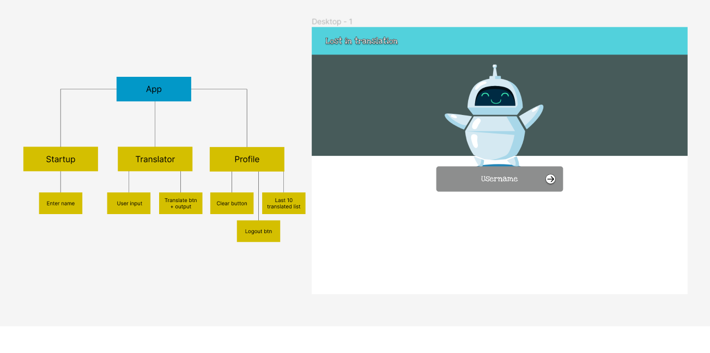
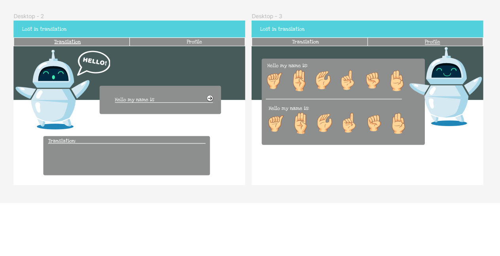

# Front-end Assignment 2: Translator app

### Table of contents

- [Introduction](#introduction)
- [Wireframe](#wireframe)
- [React and Heroku setup](#react-and-heroku-setup)
- [Adding the React components](#adding-the-react-components)
- [Where to access/installations](#where-to-acces/installation)
- [Authors](#authors)
  ​
  ​

## Introduction

​This is our submission for the second Front-end assignment in JavaScript, focusing on React and
The assignment was handed out by Piotr Dziubinski.

## Wireframe

Before we wrote any code, we created a wireframe to visualize our website. To do this we used Figma:

## React and Heroku setup

After we had completed the wireframe and had a good idea of how we wanted the app to work, we created the React project by using Reacts CRA. Before starting to develop the components themselves, we made sure to deploy our upcoming project to Heroku, giving us access to the API key and a place to write and save data for our database.

## Adding the React components

We assigned different pages to each member; Marius was in charge of the login page, Ulrik was in charge of the translation page and Linnea took care of the profile page. Each project member made views, associated components and neccessary code to make the website have its desired functionality:

The Profile page utilizes ​a ProfileHeader, ProfileActions, ProfileTranslateHistory and ProfileTranslateHistory components to achieve it's desired goals. The header simply provides custom text as to what the specific user will see when they log in, whereas the actions take care of the clear history button.
ProfileTranslateHistoryTODO
​

## Where to access/installations

Create an SSH key and pull the project from the git repository.

## Project status

Finished.
​

## License

This project is open-source. You are free to use any of the code in your own projects, as long as the work is credited.
​

## Authors and acknowledgment

**Code authors:**

- [Linnea Johansen](https://gitlab.com/LinneaJohansen)
- [Ulrik Lunde] (https://github.com/UlrikLun)
- [Marius Eriksen](https://github.com/Legazzzy)

**Assignment given by:**

Piotr Dziubinski, Lecturer at Noroff University College

